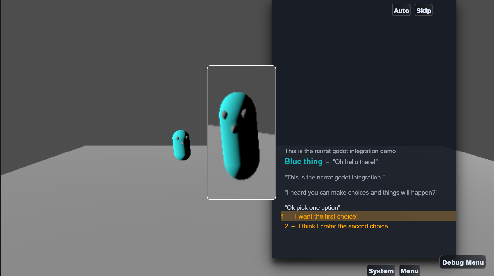
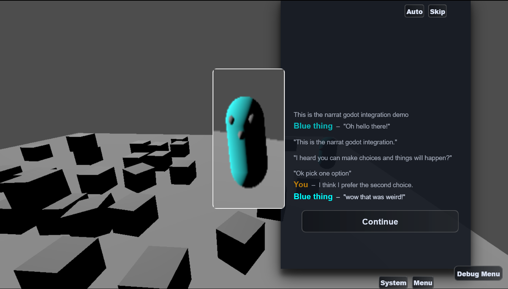
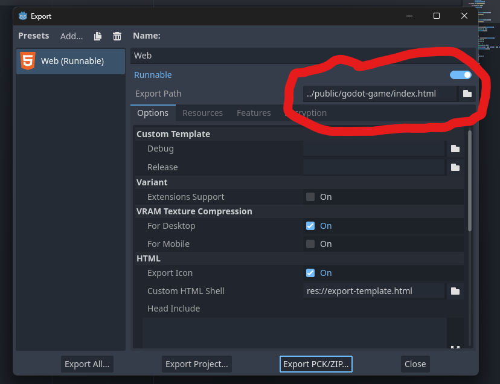
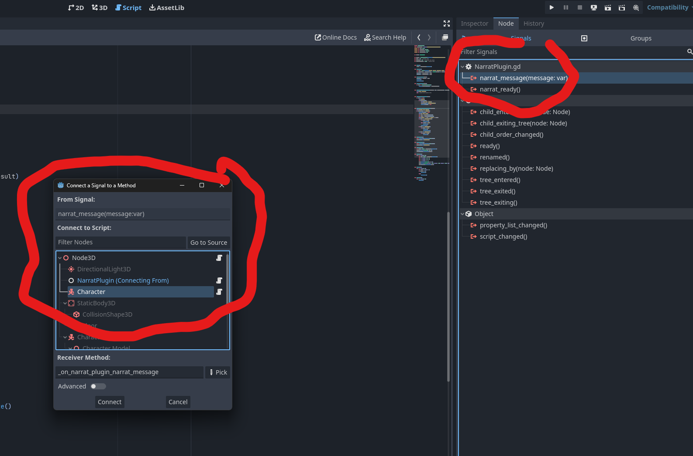
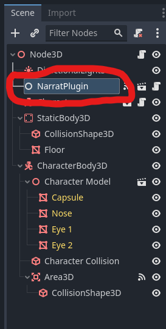

# Godot + Narrat integration example game

This example shows how to create a Godot game integrated with the Narrat game engine.

This setup works for Godot 4.1 and above, on **games built for web**. Your Godot project needs to be [configured for web export](https://docs.godotengine.org/en/stable/tutorials/export/exporting_for_web.html#), which comes with some limitations, and you can probably expect worse performance than a native build. But it works.

## Features

- Godot game embedded in a Narrat game, with Narrat UI on top of Godot
- Commands in Narrat to pause/resume Godot (useful to pause the game engine while the player is in dialogue)
- The Godot game can run labels in your narrat script, and get a result from them. This allows narrat game script and godot game to communicate and influence each other
- Godot has access to the `Narrat` object, which gives access to the Narrat API from within Godot. This can potentially allow the Godot game to directly interact with the narrat engine

## How to use

The simplest way to start using this is to copy it so it's already setup for you. Clone or download this repo, and then start editing the Narrat and Godot games.

Workflow:

- Run this game like any narrat game (`npm install`, then `npm run dev` or `npm run build`).
- Whenever you want to update the Godot game, go in Godot, and in `Project -> Export`, select the web export, press `Export Project`, and export it to `public/godot-game/index.html` (which should be the currently configured export path).
- When Godot exports the game, reloading the page with your narrat game running should pick up the newer version of the game

If you want to setup a brand new project yourself from scratch, read [the setting up on a new project](#setup-a-new-project) section below

## Screenshots




There is also a [video of this demo running](https://twitter.com/NarratEngine/status/1705666177500889545).

## How it works

The project is a Narrat project, with an exported Godot game embedded in it. Narrat is configured to use the `GodotPlugin` which takes care of launching and embedding the Godot game inside the Narrat game. Narrat gets displayed on top of Godot.

### Important files and folders

- In `vite.config.ts`, a Godot plugin is added to be able to serve the Godot game in the local server for development.
- In `src/index.ts`, the Narrat game registers the `GodotPlugin`, and gives it a godot config (notably needs to contain the path to the exported Godot game so Narrat can launch it).
- The Godot project itself gets exported to the `public/godot-game/` folder. You could use a different folder if you want as long as it gets exported somewhere within the `public` folder. Then the `godotGamePath` passed when setting up the godot plugin is for example `godot-game/export/index`. The same path needs to be edited in `index.html` to load the Godot script in the right place.
- The Godot game itself is in the `godot-game` folder, and it is simply configured to export the web build to `public/godot-game/index.html`.

### How Godot and Narrat communicate

- Once narrat starts, and with the `GodotPlugin` properly configured, Narrat will make Godot start the engine. At this point the Godot game is running behind the Narrat game, and Godot and Narrat will be able to interact
- In the Godot project, the `Narrat` folder contains scripts which help interface with Narrat. The `NarratBridge` takes care of setting up callbacks with the narrat engine and getting a reference to the narrat object, as well as the `window` object of the page, in case godot scripts need to interact with it. It uses the Godot [JavaScriptBridge](https://docs.godotengine.org/en/stable/classes/class_javascriptbridge.html), which in theory should allow you to call any JS function on those javascript objects or read values from them directly.
- The bridge has a `godot` object, which is the `GodotPlugin` instance from narrat, so functions from the narrat plugin can be called directly from godot. For example in godot using `bridge.godot.run('talk_character')` will call the `run` function in the `GodotPlugin` instance, which will run the `talk_character` label in the narrat script.
- The `NarratBridge` receives callbacks from Narrat whenever Narrat wants to send a message. It then uses godot [signals](https://docs.godotengine.org/en/stable/getting_started/step_by_step/signals.html) to emit an event whenever a new message from Narrat is received, so other elements in the godot game can listen to it and react to it.
- Whenever the `run` function is called, and once that label has finished to run in narrat, it will send a message back to Godot saying which label just ended, and what value it returned
- To see more on how Godot uses Narrat and vice versa, simply look at the narrat script and the godot scripts in this demo game. Particularly the `Character.gd` script in Godot is the one that interacts with Narrat and receives responses from it.

Messages from Godot are in the following shape:

```ts
export interface MessageForGodot {
  type: string;
  payload: any;
}
```

When a label is run in Narrat, and Narrat sends the result back to Godot, this type of message is sent:

```ts
const message = {
  type: "run_end", // This type is always used when a run label called from godot ends
  payload: {
    label, // The name of the label that was run, string
    args, // Array with the original arguments that were sent, empty if no arguments were sent
    result, // Whatever result narrat returned, if any
  },
};
```

And for example, in the demo game, Godot handles the messages returned from Narrat this way:

```gdscript
# This function is a signal connected from the NarratBridge in the scene. It gets called by Godot whenever the NarratBridge emits the signal that it received a message from Narrat.
func _on_godot_plugin_narrat_message(message):
	print("Message from narrat!")
  # The message is of type `run_end`, meaning a label we ran from godot just finished
	if (message.type == "run_end"):
		get_tree().paused = false
		print("A label ended")
		var label = message.payload.label
		var result = message.payload.result
		print("Label " + label + " Result " + result)
    # The label was `talk_character`
		if (label == 'talk_character'):
      # Depending on the value the narrat label returned, we do different things
			if (result == 'a'):
				spawn_sphere()
			elif (result == 'b'):
				spawn_cube()
			after_message()
		if (label == 'after_talk'):
			if (result == 'c'):
				big_spawn()
				after_big_spawn()
		if (label == 'last_thing'):
			if (result == 'e'):
				mega_spawn()
```

And Godot can call the bridge's run function to make things happen in Narrat, for example this happens when the player approaches the other character:

```gdscript
func _on_area_3d_body_entered(body):
	if (body == self):
		print("Hello")
		if (bridge.godot):
			print("We have a bridge")
      # This will make Narrat play the `talk_character` label
			bridge.godot.run('talk_character')
			get_tree().paused = true
```

## Setup a new project

It is recommended to simply copy this setup as a base for your game. If for whatever reason you want to use an existing narrat or godot game as a base, then follow those instructions:

1. Create or have a Narrat game ready.
2. Update `vite.config.ts` in the narrat game to add the Godot cors plugin, see the `vite.config.ts` in this repo for an example.
3. Have your Godot project somewhere (ideally in a folder inside your narrat game)
4. Setup your Godot project to export for web, and in the export settings make it export to `public/godot-game/index.html` (or somewhere else if you want a different path). We won't be using the html file exported by godot, but this is where all the game files will also be exported.
5. In your `index.html`, before the script tag that starts Narrat near the end, add the script tag for the Godot game (loading the path specified before): `<script src="godot-game/index.js"></script>`.
6. In `src/index.ts`, register the godot plugin, and initialise it with the right path to game files:
7. In your Godot project, create a `Narrat` folder, and add the contents of the `godot-project/Narrat` folder from this repo. This contains the scripts that will allow Godot to communicate with Narrat.
8. Somewhere in your Godot scene, add the `NarratBridge` scene. Then, you can connect its `narrat_message` signal to your GDScript to receive messages from Narrat. See the `Character.gd` script in this repo for an example.
9. Conversely, once you have the bridge setup, your godot scripts can have a reference to the bridge by calling `get_bridge()` on the Godot `NarratPlugin` node, ie. `var bridge = narrat_plugin.get_bridge()`.
10. Once you have your bridge setup, you can do things like `bridge.godot.run('talk_character')` to run the `talk_character` label in Narrat. See the `Character.gd` script in this repo for an example.

    Registering the godot plugin in index.ts:

```ts
// Do this just before the call to `startApp`
registerPlugin(
  new GodotPlugin({
    godotGamePath: "godot-game/index",
    engineConfigOverrides: {
      // Optional: you can override the default engine config options here. See https://docs.godotengine.org/en/stable/tutorials/platform/web/html5_shell_classref.html#EngineConfig
    },
  })
);
```

## Relevant Godot documentation

Godot doc pages you might want to know about:

- [Exporting for the web](https://docs.godotengine.org/en/stable/tutorials/export/exporting_for_web.html#)
- [Custom HTML page for web export](https://docs.godotengine.org/en/stable/tutorials/platform/web/customizing_html5_shell.html#doc-customizing-html5-shell)
- [Godot EngineConfig object](https://docs.godotengine.org/en/stable/tutorials/platform/web/html5_shell_classref.html#EngineConfig)
- [Godot JavaScriptBridge](https://docs.godotengine.org/en/stable/classes/class_javascriptbridge.html)
- [Using Signals](https://docs.godotengine.org/en/stable/getting_started/step_by_step/signals.html)

## Screenshots of the setup

### Godot Export Settings



### Connecting the NarratPlugin signal in Godot



### The NarratPlugin in a Godot scene



### Example GDScript processing a Narrat message signal


